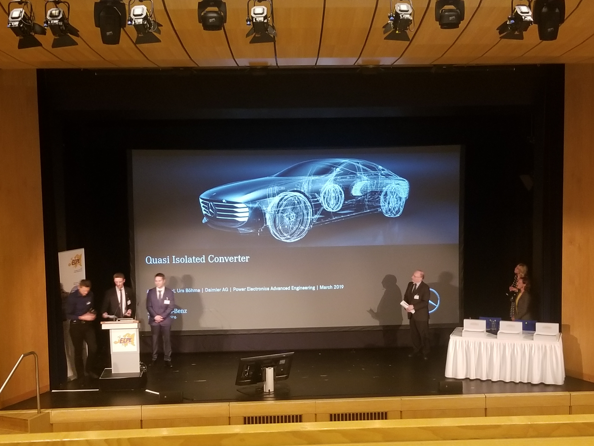

# 2019 Conferences and Seminars

## The 12th International Symposium on Linear Drives for Industry Applications (LDIA 2019), Neuchatel, Switzerland, July 1-3, 2019.
### Gökhan Çakal

#### Design of Double Sided Linear Motor with Easy to Manufacture Hairpin Plate Winding

_Abstract_: This paper presents a double sided permanent magnet linear synchronous motor (DSPMLSM) with novel V-shaped hairpin plate windings and diagonally placed square magnets. Unlike the conventional stranded round wires, proposed winding type offers easy manufacturing and high current densities. Air cored structure eliminates problems related to cogging torque. In order to obtain fast results, analytical magnetic field model of the motor is derived using magnetic scalar potential and verified with finite element analysis. Optimization using genetic algorithm is executed with analytical model, and 1 kW, 150 N, and 30 A DSPMLSM is proposed.

 
 

## Pulsed Power and Plasma Science Conference 2019 Orlando, USA 23-28 June, 2019
### Hakan Polat

#### Utilization and Optimization of Superconducting Coil Parameters in Electromagnetic Launcher Systems

_Abstract_: The utilization of external field windings in electromagnetic launchers provides an additional electromagnetic field between the rails of an electromagnetic launcher which increases the Lorentz force acting on the armature in the acceleration direction. However, additional magnetic field created by the conventional copper windings are very limited due to their low maximum current carrying capability. Therefore, using high temperature superconductors (HTS) with a current carrying capability up to 100 A/mm^2 for the external coils can be used to increase the magnetic field density between  rails. This paper presents an optimization study for the design of two external coils with rectangular tape YBCO superconducting wire. The HTS coils are proposed to increase the efficiency of a 3 meter long launcher with 25 mm x 20 mm rectangular bore caliber. The optimization parameters are selected as the magnitude of the DC coil current, the coil position, the number of turns of the coil, and the number of coil layers. Also, the objective function of the optimization is the electromagnetic force acting on the armature, which is dependent of the rail current and B field on the armature. During the operation of the launcher and the external coils, it is critical to prevent quenching of the HTS coils due to the perpendicular and tangential magnetic field on the coils, temperature and current density of the coils. In order to estimate the quench and calculate the objective function, finite element analysis (FEA) is used in 2D. Real coded genetic algorithm (RCGA) is also used as optimization method. The results of the optimization study shows that HTS coil augmentation is feasible for small caliber railguns. The HTS coil position is limited by cryogenic chamber and rail containment dimensions. The maximum coil current is determined by the self field due to cancellation B field generated by the rails and the coils. For 500 kA rail current the force acting on the armature increases from 55 kN to 70 kN with and increase rate of 26\% , a muzzle velocity increase from 1650 m/s to 1900 m/s with an increase rate of 12\% and a muzzle energy increase from 160 kJ to 210 kJ with and increase rate of 25\% when external HTS coil augmentation is used.

## 2019 IEEE 13th International Conference on Power Electronics and Drive Systems (PEDS), Toulouse, France, 9-12 July 2019
### Göksenin Hande Bayazıt
#### Fault Tolerance Capabilities of Three, Four and Six-Phase Configurations of a 24 Slot Modular PMSM

_Abstract_: In this study, fault tolerance and redundancy capabilities of different phase and winding configurations of an Integrated Modular Motor Drive (IMMD) system are investigated. This is made possible by manipulating gate drive signals of the inverter and phase connections. Three and four phase connections as well as symmetric and asymmetric six-phase topologies are described. Control strategies and redundancy possibilities of these different topologies under an open circuit fault condition are examined in MATLAB/Simulink environment and validated with Finite Element Analysis (FEA) software ANSYS/Maxwell. Considering a decrease of only 12% in average output torque and 0.7% torque ripple under an open circuit failure recovery operation with rated currents, symmetric six-phase topology is decided to be the most promising configuration by means of fault tolerance.

## EPE’19 ECCE Europe, Genova, Italy, September 2-6 2019
### İlker Şahin
#### A Simplified Discrete-Time Implementation of FCS-MPC Applied to an IM Drive

_Abstract_: Model predictive control (MPC) has drawn significant attention from the power electronics research community in the last decade. Regarding the application of MPC in motor control, several studies have been conducted that include design and implementation of various predictive torque control techniques. In this study, MPC of an induction motor is implemented via TMDXIDDK379D, a motor drive development platform produced by Texas Instruments (TI). The main motivation is to show the engineers and researchers a way of simple, fast and low cost experimentation on MPC. By using an off the shelf motor drive development platform and modifying the existing macros and libraries for motor control, the implementation time and difficulty can be reduced considerably. Extensive experimental data on the drive performance is also provided.

## 2019 IEEE 13th International Conference on Compatibility, Power Electronics and Power Engineering (CPE-POWERENG), Sonderborg, Denmark, 23-25 April 2019.

### Hüseyin Yürük

#### High Bandwidth Current Control via Nonlinear Compensation and GaN-based VSI

_Abstract_: Nonlinearities in the voltage source inverter (VSI) such as dead time, switching time, delay time, voltage drops on the power switches, parasitic capacitances etc. are considered to be the main sources of the output voltage distortions. These distortions result in low order harmonics in the output current, which in turn increase core losses and create torque ripples. In particular, in the low speed and low torque applications the control performance and the stability of the system degrades substantially. Although as the switching frequency increases the effects of the dead time, the switching time and the delay time become more notable, to achieve a high current control bandwidth higher switching frequency is required. High performance VSI-fed motor drive can be realized both by reducing the effects of the VSI nonlinearities and by having a high current control bandwidth. In this work, GaN transistor based VSI-fed permanent magnet synchronous motor (PMSM) drive is used to achieve a high current control bandwidth. Since the current loop is the inner most loop of the control loop, it enables the outer speed and position loops to be faster. This high performance servo motor drive can be used in applications such as control of pedestals, robot arms, optic stabilizers, CNC machines, active vibration cancellers etc. that require high control bandwidths.

##  2019 IEEE Energy Conversion Congress and Exposition (ECCE),  Baltimore, MD, USA, 29 Sept.-3 Oct. 2019.

### Öztürk Şahin Alemdar
#### PCB Layout Based Short-Circuit Protection Scheme for GaN HEMTs

_Abstract_: Gallium Nitride Enhancement-Mode High Electron Mobility Transistors (GaN HEMTs) are superior to other power transistors in terms of efficiency, package size and switching speed which leads to increased power density in power converter applications. However, GaN HEMTs have much shorter short-circuit withstand time compared to the conventional devices, which is limited to several hundred nanoseconds. Therefore, reliable and fast protection solutions are required to protect GaN HEMTs from fatal over-current failures. In this paper, a novel short-circuit (SC) protection scheme based on fault current sensing by using Printed Circuit Board (PCB) layout parasitics is proposed. The proposed scheme uses the voltage drop on the parasitic inductance of the PCB trace to detect very intense high slew rate SC faults. In addition, the voltage drop on the parasitic resistance of the PCB trace is utilized to detect relatively slow over-current (OC) faults. Once a fault is detected, a soft turn-off mechanism is initiated by the proposed circuit to turnoff devices gradually to eliminate over-voltage breakdown risk. The proposed circuit is verified by both SPICE simulations and hardware implementation. The experimental results show that both SC and OC faults can be detected and GaN HEMTs can be protected. The total operation duration for the circuit is 370 ns during a SC fault. The SC fault can be detected within 30 ns and the soft turn-off mechanism is initiated within 80 ns to terminate the SC current flowing through the GaN HEMTs within 290 ns.

## ECPE Tutorial 'Power Circuits for Clean Switching and Low Losses', 17-18 October 2018, Lyon, France
### Furkan Karakaya

The tutorial covered the best layout design techniques to minimize parasitic effects on a circuitry. The source of disturbances is analyzed and explained.

## ECPE SiC & GaN Forum Potential of Wide Bandgap Semiconductors in Power Electronic Applications, 26-27 March 2019, Munich, Germany
### Furkan Karakaya
Researchers from all around the world had met to discuss the future potentials of wide bandgap semiconductors in power electronics applications. Researchers shared experience and ideas to discuss and find out which power electronic systems are predestinated for the usage of wide bandgap devices and how to appropriately design-in those novels, almost ideal but also challenging components.

## E3 - EPFL Excellence in Engineering Summer Fellowship Program, 1 June - 28 August 2019, Lausanne, Switzerland
### Furkan Karakaya
I joined Powerlab research group at EPFL under the supervision of Prof. Elison Matioli. I mainly studied on a GaN-based Dual-Active-Bridge Converter project and I have designed a control board for this project. Besides, I worked on the characterization of gate charge of GaNFETs and we characterized gate charge for soft-switching and hard-switching conditions.  

## ECPE Workshop:“Power Semiconductors in Medium Voltage Applications- SiC vs. Silicon”, December 3-4, 2019, Freiburg, Germany.
### Enes Ayaz
The workshop is organized by ECPE , the European Center for Power
Electronics, which has a lot of industrial members such as ABB, BMW,
ALSTOM, etc. The workshop is mainly about the comparison of SiC and
Silicon-based power semiconductors such as IGBTs and diodes for medium
voltage applications. It lasted 2 days and there were 22 sections that
are divided into the topics which are called High Voltage Power
Devices, High Voltage Packaging, and Isolation, Passive Components,
Medium Voltage Converter design, Gate driver for medium voltage and
Future of the DCHV. Also, there were  lab tours to Fraunhofer ISE. The
laboratories are used for 100kV/20kV/40MVA AC/AC (Transformer), DC/AC
(Inverter Applications), DC/DC (SMPS topologies)
