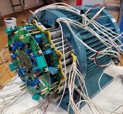
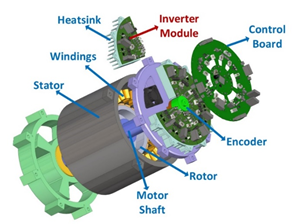

## Development of a 7.5 kW Permanent Magnet Integrated Modular Motor Drive System

#### Project Budget: 150,000 TL
#### Project Duration: 26 month
#### Project Start Date: 15.10.2017
#### Project End Date: 15.12.2019

### Brief Summary: 
In this project, it has been aimed to combine the motor and motor drive,
which are separately packaged conventionally, and obtain an integrated
modular motor drive (IMMD) system. This system is expected to introduce
major advantages in aerospace, automotive and defense industries with size
reduction, fault tolerance and modularity. Moreover, utilization of new
generation Gallium Nitride (GAN) transistors, which have gained popularity
in recent years, has been achieved to obtain efficiency and power density
increase.

In the project, an 8 kW, 600 rpm permanent magnet motor suitable for direct
drive applications, and four GaN based motor drive inverters each having 2
kW rated power are developed, manufactured and successfully tested.
Furthermore, to control these four motor drive modules, a motor drive
control board containing a dual core microcontroller is developed which is
also integrated to the motor.

GaN based motor drive is tested at rated power (2 kW), 40 kHz switching
frequency and 300 V DC bus voltage, and has reached up to 98.7 % efficiency
levels. The power density of the motor drive module is 2.8 kW/lt. Moreover,
the motor drive modules are operated in series and parallel connection
configurations on the DC bus and the resulting current and voltage
unbalance cases are investigated. Phase-shifting technique is used in
series and parallel configurations and it has been shown that the capacitor
voltage ripple and capacitors size can be reduced.

The developed motor is tested under several speed and loading conditions
and 96 % efficiency level is obtained. Fault tolerance and modularity is
achieved in the developed motor which has four stator winding groups, in
compliance with the motor drive modules. With this prototype, a
comprehensive know-how is attained for future studies on the topics of
integrated motor drives, modularity, GaN based motor drives and permanent
magnet motors.

