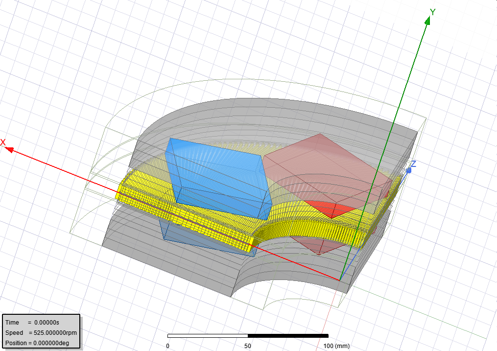

## Fault Tolerant Multiphase Axial Flux PM Synchronous Machine

### Main Motivation
Electric machines have widely been used for electric power generation, industrial and
domestic applications since they had been invented. Mainly for industrial applications,
with an increasing number of automated systems, pneumatic and hydraulic systems are
being replaced with electric drives, due to their better and faster controllability.
Consequently, the reliability of electric drive systems gains importance because of their
wide use of safety-critical industrial applications such as aviation, military systems, power
generation and automotive. In general sense, under fault occurrence, such electric drive
systems should be able to maintain near-proper operation and its elements should be
resistant to possible irreversible damages caused by system failures.

### Brief Summary: 
In this study, the design and manufacturing of a five-phase axial flux permanent magnet synchronous machine will be completed considering the mentioned requirements. After that, fault mitigation tests will be performed on the machine to observe the fault tolerance capability of the machine.

The machine topology is chosen as axial flux, unconventionally. Main advantages of this topology is high torque production capability and its fault-tolerant winding topology. To visualize, one fourth slice of the machine is presented below.

The stator of the machine is air-cored and the coils are made of solid aluminum sheets instead of stranded cables. This winding topology lowers the risk of inter-turn short circuit failures substantially and simplifies the manufacturing process.

#### Why multiphase?
In a conventional three-phase machine, the machine is unable to produce a balanced rotating MMF. As a result, there will be unbalanced and large current flows in the windings and oscillating output torque. On the other hand, in case of a fault in a multiphase machine, the remaining phases are still able to produce a balanced rotating MMF and a balanced, non-oscillating output torque, with some manipulations in the input currents. (For further details, refer to [this paper](https://ieeexplore.ieee.org/abstract/document/8998851).)

For more information about the project, please contact G. Hande Bayazıt.
